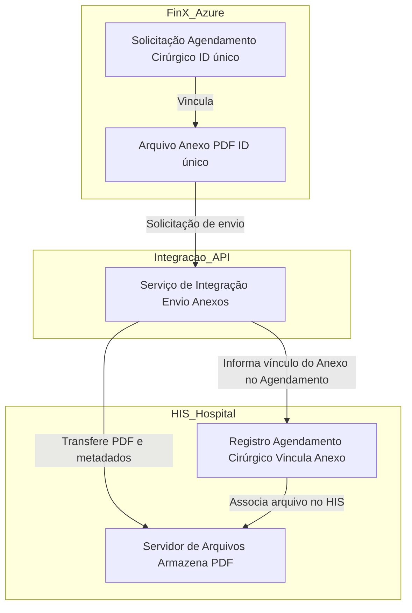

## Desafio 2: Integração de Anexos Fin-X → HIS (Tasy, MV, etc.)

### Diagrama de fluxo

### Explicação detalhada do funcionamento

1. **Armazenamento na Fin-X (Azure):**  
   Armazenamos todos os PDFs no Azure Blob Storage, onde cada arquivo tem seu próprio ID único. Tudo armazenado na Azure, sem depender de outros serviços externos. Cada PDF está sempre linkado com uma solicitação de cirurgia específica (que também tem seu ID), o que seria fácil rastrear de onde veio cada documento.

2. **Enviando para o Hospital:**  
   Quando precisamos mandar um anexo pro sistema do hospital, a própria aplicação dispara o processo. Pode ser via API REST, fila de mensagens, ou um outro meio possívell. O importante é passar o ID da cirurgia, o ID do arquivo e alguns dados extras tipo data, quem está enviando, que tipo de documento é, essas coisas.

3. **O Serviço que Faz a Ponte:**  
   Poderiamos usar Functions, App Service, Logic Apps, ou outro meio. O que ele faz:
   - Pega o arquivo do Blob Storage usando o ID
   - Ajusta os dados pro formato que o hospital espera
     

4. **Do Lado do Hospital:**  
   O sistema do hospital recebe os dados. Geralmente tem um serviço específico pra isso, que:
   - Liga o documento com a cirurgia certa usando o ID
   - Atualiza os logs pra depois conseguir rastrear tudo

5. **Pronto pra Usar:**  
   Depois que tudo termina, o anexo estará disponível em um storage da Azure. Quem tem permissão pode ver, baixar ou abrir o documento direto pelo sistema.

6. **Possíveis extensões e preocupações técnicas:**  
   - **Controle de erros e reenvio:** O sistema deve lidar com falhas de transmissão, integridade de arquivos e permitir reenvio automático ou manual em caso de erro.
   - **Segurança:** Todo o processo deve ser protegido por autenticação, autorização e criptografia dos dados em trânsito e em repouso.
   - **Escalabilidade:** A solução deve suportar o envio em lote de vários anexos e múltiplos hospitais, caso necessário.
   - **Monitoramento:** É recomendável implementar monitoramento e alertas para operações não concluídas, lentidão ou falhas de integração.
   - **Logs de auditoria:** Manter logs detalhados de quem enviou, quando, e para qual hospital/sistema, garantindo rastreabilidade.
