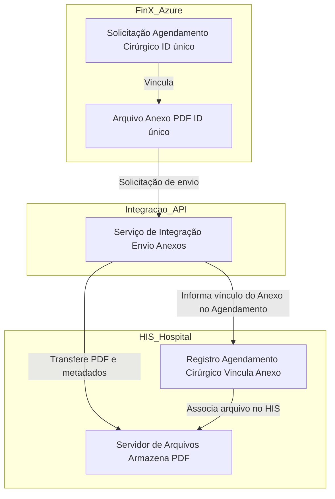

## Desafio 2: Integração de Anexos Fin-X → HIS (Tasy, MV, etc.)

### Diagrama de fluxo

### Explicação detalhada do funcionamento

1. **Armazenamento Inicial na Fin-X (Azure):**  
   Os anexos (arquivos em PDF) são armazenados em um serviço de storage na Azure, cada um identificado de forma única (ID do arquivo). Cada arquivo é vinculado a uma Solicitação de Agendamento Cirúrgico, que também possui um identificador exclusivo. Isso garante rastreabilidade e organização dos documentos desde a origem.

2. **Solicitação de Envio e Disparo do Processo de Integração:**  
   Quando é necessário compartilhar um anexo com o sistema hospitalar (HIS), a aplicação ou operador dispara uma solicitação para o Serviço de Integração. Essa solicitação pode envolver uma chamada a uma API REST, envio de mensagem para uma fila, ou outro mecanismo de integração, contendo o ID do agendamento, o ID do anexo e, possivelmente, outros metadados (data, responsável, tipo de documento, etc).

3. **Serviço de Integração:**  
   O Serviço de Integração atua como ponte entre os dois ambientes. Ele pode ser implementado como uma API, um conector, ou uma aplicação intermediária hospedada na nuvem ou on-premises, dependendo do cenário do cliente. Suas responsabilidades incluem:
   - Buscar o arquivo no Azure Storage a partir do ID recebido.
   - Validar e transformar os metadados conforme o padrão do HIS.
   - Garantir segurança durante a transferência (criptografia, autenticação, logs).
   - Enviar o arquivo e os metadados para o ambiente do hospital, utilizando o protocolo ou API aceito pelo HIS (exemplo: upload via SFTP, REST, SOAP, etc).

4. **Recepção pelo HIS (Hospital Information System):**  
   No lado do hospital, o HIS recebe o arquivo PDF e os metadados. Normalmente, há um endpoint ou serviço dedicado para importação de documentos, que:
   - Armazena o PDF em seu próprio servidor de arquivos, seguindo as políticas do hospital (nomeação, diretórios, backup, etc).
   - Realiza o vínculo do documento ao agendamento cirúrgico correto, usando o identificador recebido.
   - Atualiza eventuais logs ou históricos para rastreabilidade e auditoria.

5. **Associação, Consulta e Auditoria:**  
   Uma vez o processo concluído, o anexo fica disponível no HIS, devidamente associado ao agendamento cirúrgico. Usuários autorizados podem consultar, baixar ou visualizar o documento diretamente pelo sistema hospitalar, garantindo integridade, disponibilidade e conformidade com requisitos legais e de auditoria (LGPD, etc).

6. **Possíveis extensões e preocupações técnicas:**  
   - **Controle de erros e reenvio:** O sistema deve lidar com falhas de transmissão, integridade de arquivos e permitir reenvio automático ou manual em caso de erro.
   - **Segurança:** Todo o processo deve ser protegido por autenticação, autorização e criptografia dos dados em trânsito e em repouso.
   - **Escalabilidade:** A solução deve suportar o envio em lote de vários anexos e múltiplos hospitais, caso necessário.
   - **Monitoramento:** É recomendável implementar monitoramento e alertas para operações não concluídas, lentidão ou falhas de integração.
   - **Logs de auditoria:** Manter logs detalhados de quem enviou, quando, e para qual hospital/sistema, garantindo rastreabilidade.
